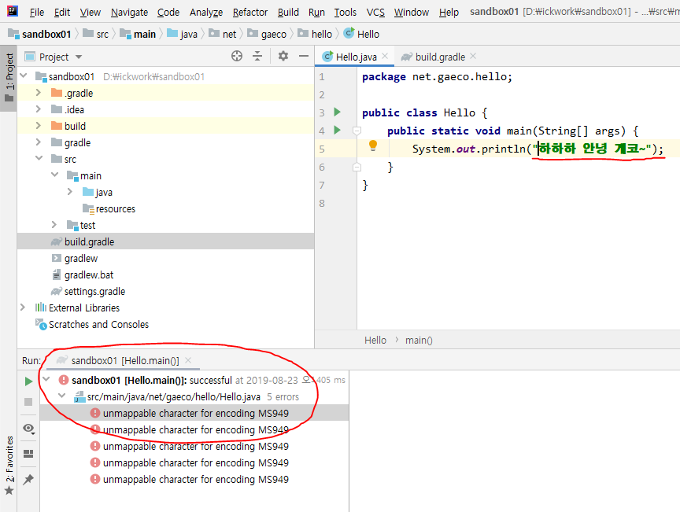

### Gradle build시 한글문제(unmappable character for encoding MS949)로인한 오류 잡기

* 발생 OS : Windows 10 한글버전
* 현상 : MS949문제로 `unmappable character for encoding MS949` 오류 표시하며 빌드 실패

* 조치 : gradle.build 파일에 아래와 같이 추가
```
tasks.withType(JavaCompile) {
    options.encoding = 'UTF-8'
}
javadoc {
    options.encoding = 'UTF-8'
}
```
