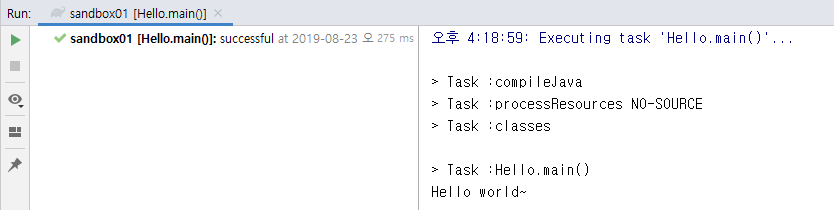
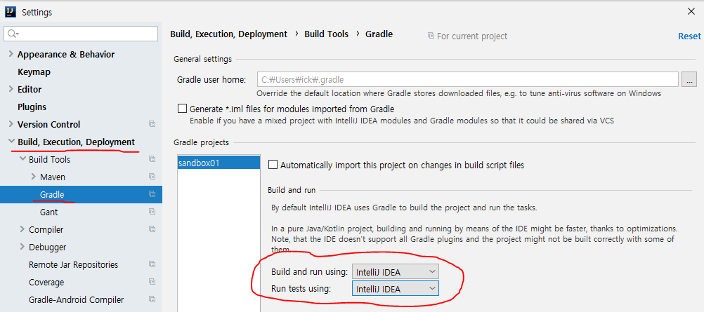

### Intellij에서 gradle프로젝트를 Gradle Daemon이 아닌 Intellij로 실행하기
* 발생환경 : Intellij 2019.2 버전. (2019.1 버전에서는 빌드가 Intellij으로 기본 실행됨)
* 문제 : 프로젝트를 Gradle로 구성할 경우 기본 gradle daemon으로 빌드 및 실행됨

  이렇게 되면 반응도 느리고 gralde상에서의 한글 깨짐문제도 고질적으로 나타난다.
* 조치 : File > Settings > Build, Execution, Deployment > Gradle 메뉴에서 `Build and run using: `과 `Run tests using: `을 'Intellij IDEA'로 변경해준다

